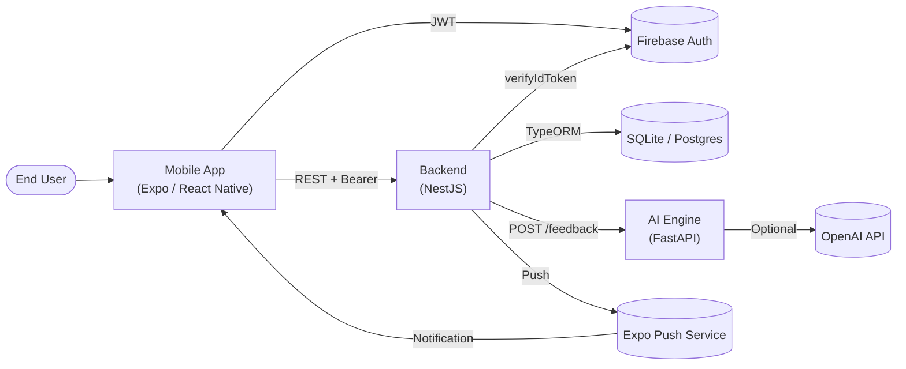
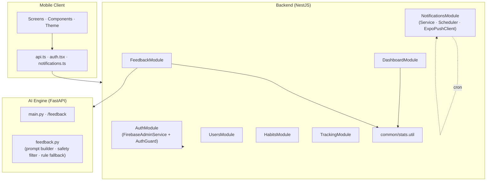
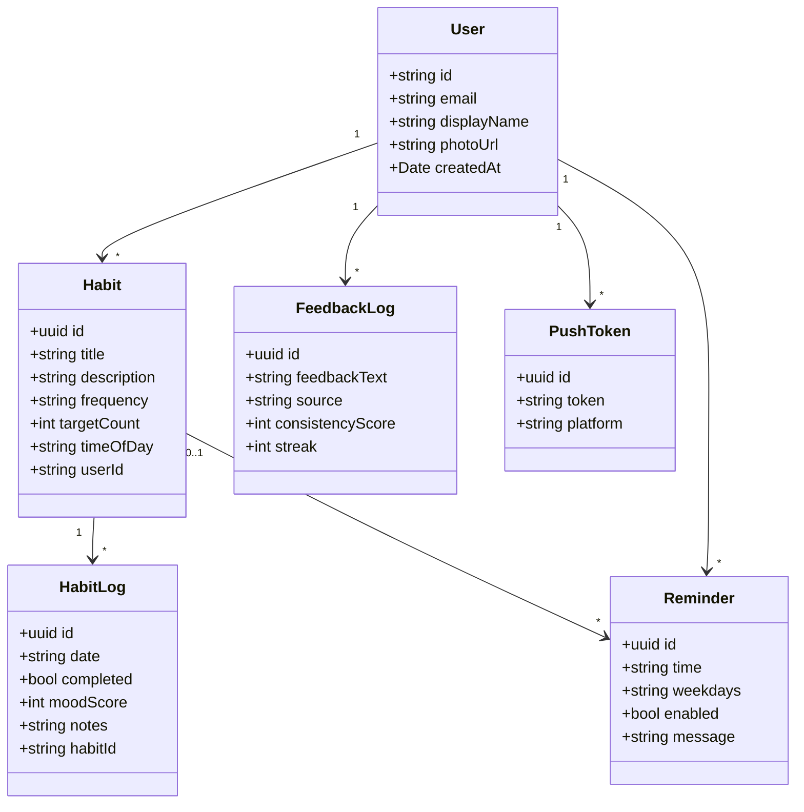
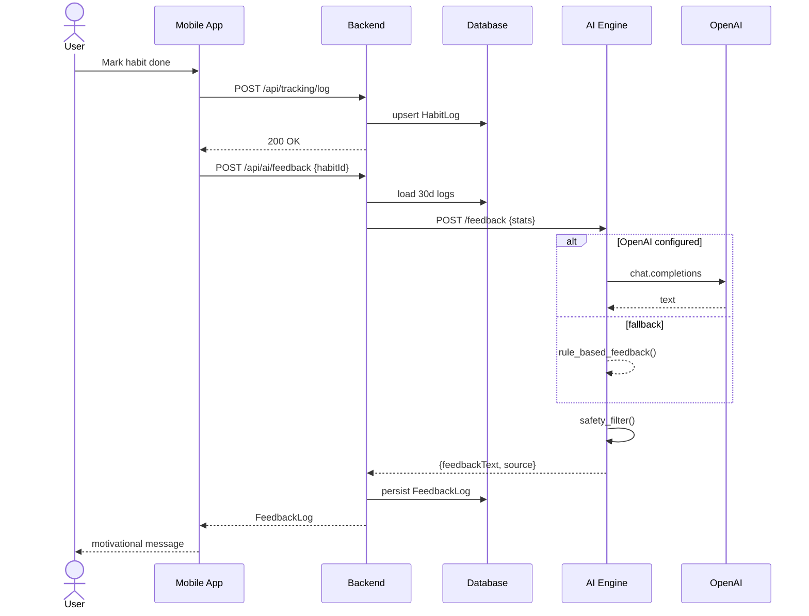
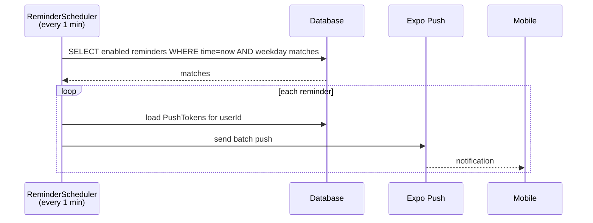

# Reveil — Architecture Diagrams

This file expands on the SDD viewpoints with renderable Mermaid diagrams. GitHub renders Mermaid natively in Markdown.

## 1. Context (SDD §3.1)

## 2. Composition (SDD §3.2)

## 3. Logical / Class (SDD §3.3)

## 4. Information / Data (SDD §3.4)

| Entity | Indexes | Key constraints |
| --- | --- | --- |
| User | PK `id` (Firebase UID), unique `email` | — |
| Habit | PK `id` (uuid), FK `userId` | cascade delete via app logic |
| HabitLog | PK `id`, indexes on `date`, `habitId`, **unique `(habitId, date)`** | upsert on duplicate |
| FeedbackLog | PK `id`, FK `userId`, FK `habitId` (nullable) | `habitId` → SET NULL on habit delete |
| Reminder | PK `id`, FK `habitId` (nullable, cascade on delete) | weekdays stored as ISO `1..7` CSV |
| PushToken | PK `id`, unique `(userId, token)` | platform ∈ {expo, fcm, apns} |

## 5. Process (SDD §3.5)

### Habit-tracking and feedback flow

### Reminder scheduling

